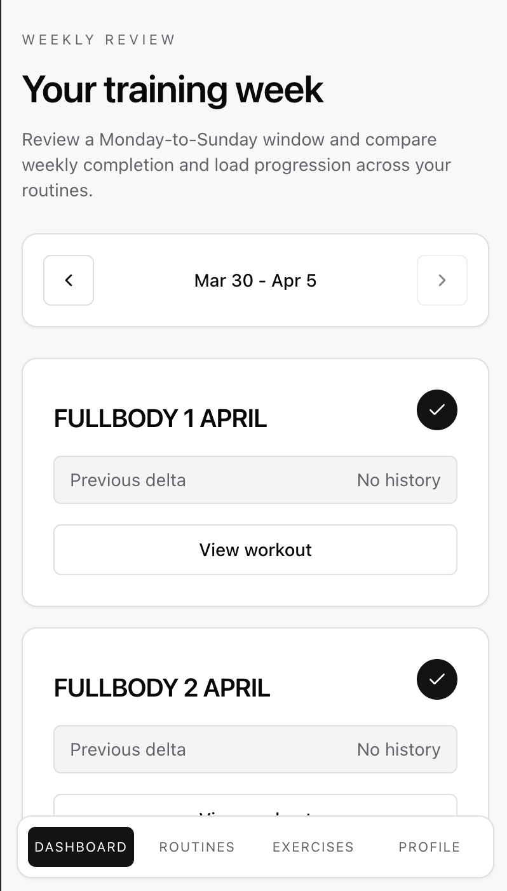
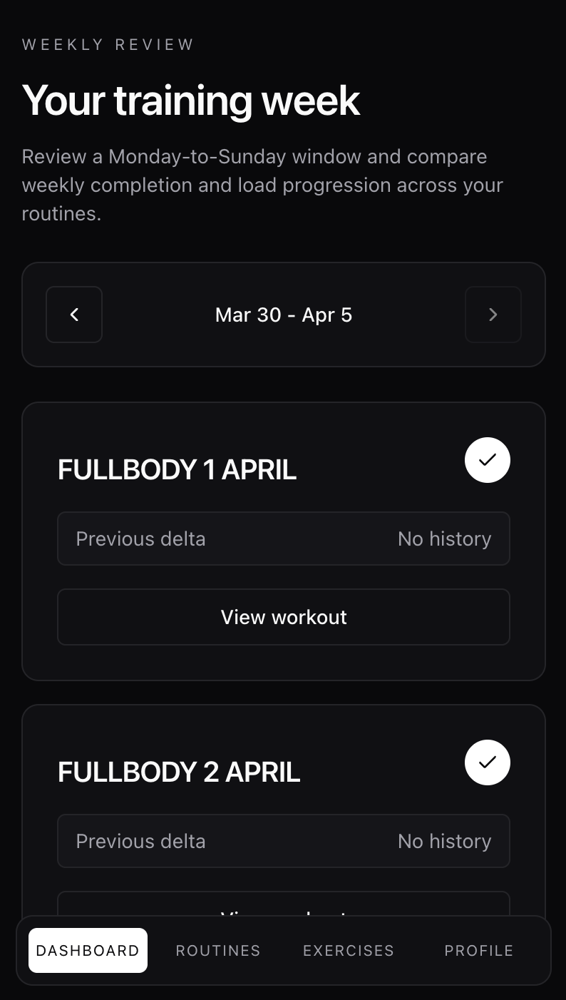
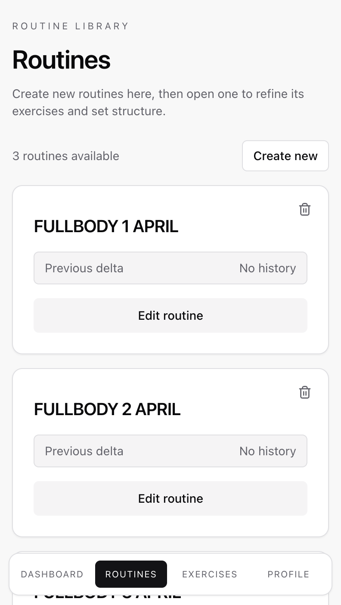
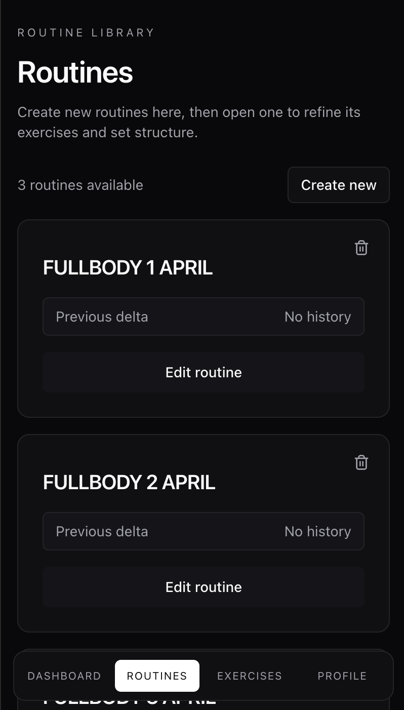
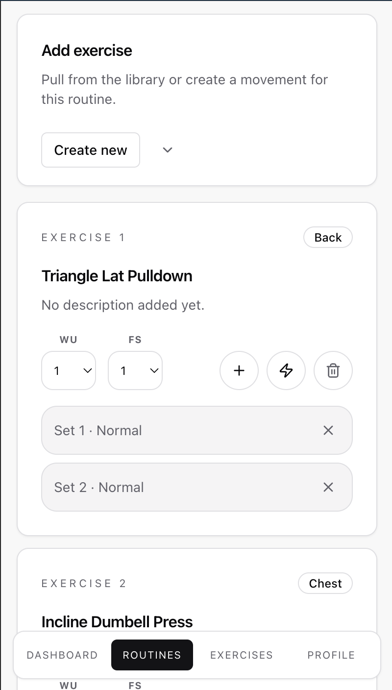
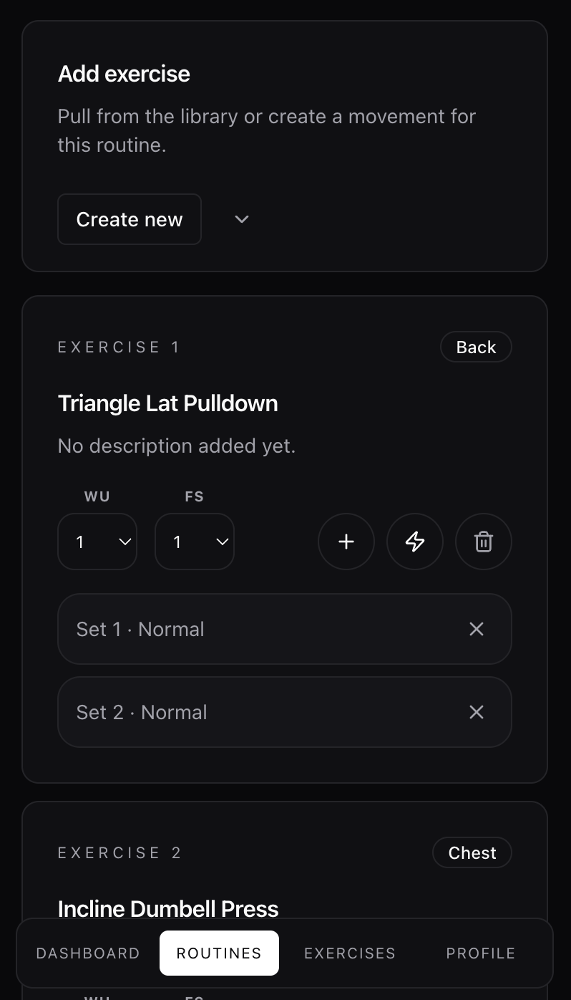
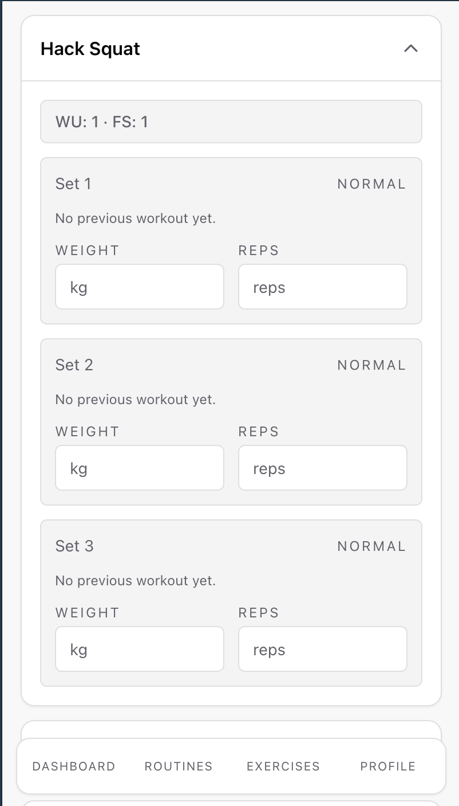
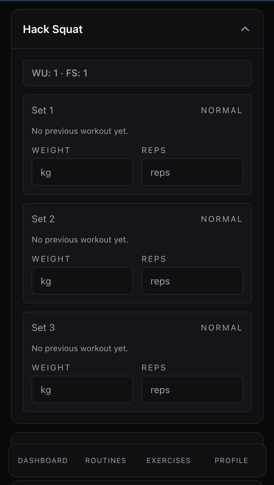
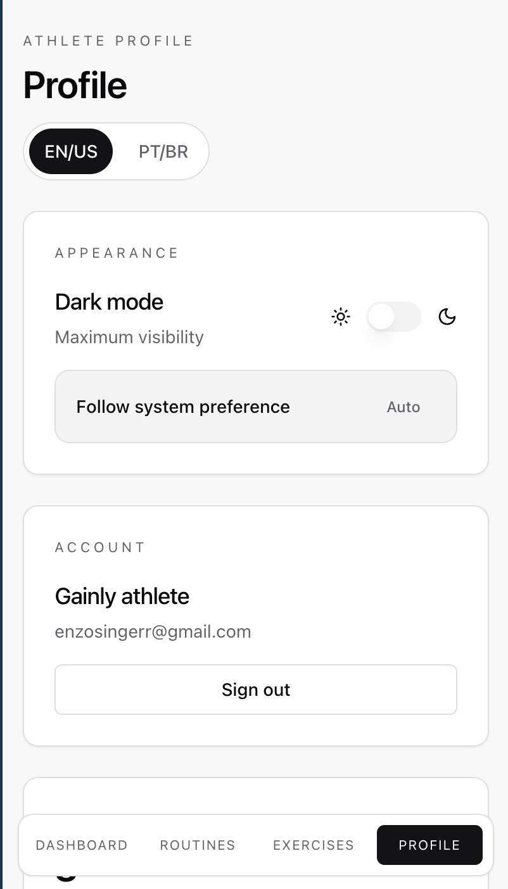
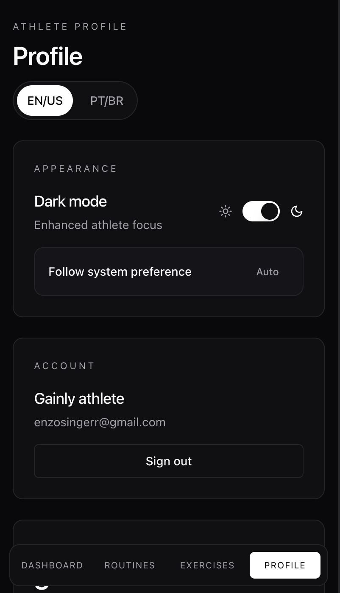

<p align="center">
  <picture>
    <source media="(prefers-color-scheme: dark)" srcset="./gainly_logo_white.png" />
    
  </picture>
</p>

[](https://react.dev/)
[](https://vite.dev/)
[](https://www.typescriptlang.org/)
[](https://convex.dev/)
[](https://vitest.dev/)
[](#license)

---

## EN

`gainly` is a full-stack training app for lifters who want structure without noise. It combines workout planning, exercise library management, session logging, and weekly progress tracking with real-time persistence through Convex.

### What it does

- sign in and sign up with email and password
- create, edit, and delete training routines
- build workouts with exercises, sets, and advanced techniques
- log weight, reps, and superset pairs during a session
- review weekly routine summaries and training progress
- manage a shared exercise library with muscle-group filtering
- switch between light, dark, and system theme
- switch the interface language between `en` and `pt`

### Key Differentiators

- reactive data persistence through Convex
- workout sessions restored by routine and week window
- shared exercise catalog between routine builder and workout logger
- support for warmup sets and feeder sets in the training flow
- index-driven Convex schema for predictable reads
- bilingual UI and theme preferences stored on the client
- practical screens focused on the training workflow

### Stack

- React 19
- TypeScript
- Vite
- Convex
- `@convex-dev/auth`
- React Router
- Tailwind CSS
- Radix UI
- `dnd-kit`
- `lucide-react`
- Sonner
- Vitest + Testing Library

### Features by Area

#### Authentication

- password-based authentication with Convex Auth
- landing page for unauthenticated users
- authenticated app shell for signed-in users

#### Dashboard

- Monday-to-Sunday weekly window
- previous/next week navigation
- weekly routine summaries
- empty state with a call to action for first-time users

#### Routines

- create new routines
- view routine cards
- open routine details for editing
- delete routines with confirmation

#### Routine Builder

- add and remove exercises
- add extra sets, including warmup sets and feeder sets
- use techniques such as back-off, cluster, and superset
- persist the routine structure in the backend

#### Exercise Library

- browse the shared movement catalog
- filter by muscle group
- create, edit, and remove exercises
- reuse the same exercise entries across routines and workouts

#### Workout Logger

- restore the active session for the selected routine and week
- log weights and reps set by set, including warmup and feeder sets
- compare current values with the previous completed workout
- complete the session and persist the result

#### Profile

- view routines, exercises, and weekly set counts
- toggle theme
- change language
- sign out

### Screenshots

Mobile view captures live in `./docs/screenshots` and are referenced directly below.

#### Dashboard

<table>
  <tr>
    <td align="center">
      
      <br />
      Light
    </td>
    <td align="center">
      
      <br />
      Dark
    </td>
  </tr>
</table>

#### Routines

<table>
  <tr>
    <td align="center">
      
      <br />
      Light
    </td>
    <td align="center">
      
      <br />
      Dark
    </td>
  </tr>
</table>

#### Routine Builder

<table>
  <tr>
    <td align="center">
      
      <br />
      Light
    </td>
    <td align="center">
      
      <br />
      Dark
    </td>
  </tr>
</table>

#### Workout Logger

<table>
  <tr>
    <td align="center">
      
      <br />
      Light
    </td>
    <td align="center">
      
      <br />
      Dark
    </td>
  </tr>
</table>

#### Profile

<table>
  <tr>
    <td align="center">
      
      <br />
      Light
    </td>
    <td align="center">
      
      <br />
      Dark
    </td>
  </tr>
</table>

### Convex Best Practices Used Here

- validate every function argument with `v.*` or project validators
- check user identity server-side with `ctx.auth.getUserIdentity()`
- keep schema and indexes explicit in `convex/schema.ts`
- prefer bounded reads and indexed queries
- keep multi-entity writes atomic inside a single mutation
- separate public and internal Convex functions
- use typed `Id<...>` references instead of raw strings

### Local Development

#### Requirements

- Node.js installed
- npm installed
- a Convex deployment

#### Environment Variables

- `VITE_CONVEX_URL`: Convex deployment URL used by the React client
- `CONVEX_SITE_URL`: issuer URL used by `convex/auth.config.ts`

#### Commands

```bash
npm install
npx convex dev
npm run dev
```

Other useful commands:

```bash
npm run build
npm test
npm run test:run
npm run preview
```

### Deploy

#### Convex backend

Use the Convex CLI to deploy the backend:

```bash
npx convex deploy
```

If you are deploying to production, use the production target configured in your Convex workflow and keep `CONVEX_SITE_URL` aligned with that deployment.

#### Frontend

This repository includes a `vercel.json` rewrite so the SPA can be deployed on Vercel with client-side routing support.

Recommended deployment flow:

1. build the app with `npm run build`
2. set `VITE_CONVEX_URL` in the hosting provider
3. deploy the built static frontend
4. verify the deployed frontend points to the correct Convex deployment

### Project Structure

- `src/app` - app composition, router, and layout
- `src/pages` - route-level screens
- `src/components` - reusable UI and feature components
- `src/state` - Convex-backed store and client state bridge
- `src/i18n` - translations and language selection
- `src/lib` - shared utilities
- `src/styles` - global styles
- `convex` - schema, auth, queries, mutations, and actions
- `docs/sources` - architecture and domain documentation
- `scripts` - test automation helpers

### License

This project is licensed under the [MIT License](./LICENSE). You may use, copy, modify, merge, publish, distribute, sublicense, and sell copies of the software, provided the copyright notice and license text are included.

---

## PT-BR

`gainly` é um app full-stack para treino e acompanhamento de performance, construído para quem quer organizar o treino com estrutura, sem depender de planilhas ou anotações soltas. O sistema combina planejamento de rotinas, biblioteca de exercícios, registro de sessões e acompanhamento semanal com persistência reativa via Convex.

### O que o app faz

- autenticação com e-mail e senha
- criação, edição e remoção de rotinas
- montagem de treinos com exercícios, sets e técnicas avançadas
- registro de carga, repetições e supersets durante a sessão
- acompanhamento de progresso semanal por rotina
- gestão de uma biblioteca compartilhada de exercícios
- alternância entre tema claro, escuro e sistema
- troca de idioma entre `en` e `pt`

### Diferenciais do projeto

- persistência reativa com Convex
- sessão de treino restaurada por rotina e janela semanal
- catálogo de exercícios compartilhado entre builder e logger
- suporte a `warmup sets` e `feeder sets` no fluxo de treino
- schema Convex orientado a índices para leituras previsíveis
- interface bilíngue e preferências de tema persistidas no cliente
- telas pensadas para fluxo real de treino

### Stack

- React 19
- TypeScript
- Vite
- Convex
- `@convex-dev/auth`
- React Router
- Tailwind CSS
- Radix UI
- `dnd-kit`
- `lucide-react`
- Sonner
- Vitest + Testing Library

### Funcionalidades por área

#### Autenticação

- login e cadastro com senha via Convex Auth
- landing page para usuários não autenticados
- shell do app para usuários logados

#### Dashboard

- janela semanal de segunda a domingo
- navegação entre semanas
- resumo semanal por rotina
- estado vazio com CTA para começar

#### Rotinas

- criação de novas rotinas
- visualização em cards
- edição de rotina em tela dedicada
- exclusão com confirmação

#### Editor de rotina

- inclusão e remoção de exercícios
- adição de sets extras, incluindo `warmup sets` e `feeder sets`
- suporte a `back-off`, `cluster` e `superset`
- persistência da estrutura no backend

#### Biblioteca de exercícios

- navegação pelo catálogo compartilhado
- filtro por grupo muscular
- criação, edição e exclusão de exercícios
- reutilização dos mesmos exercícios em rotinas e treinos

#### Workout Logger

- restauração da sessão ativa da rotina na semana selecionada
- registro de peso e repetições set a set, incluindo `warmup sets` e `feeder sets`
- comparação com o treino concluído anterior
- finalização da sessão com persistência

#### Perfil

- contagem de rotinas, exercícios e sets semanais
- troca de tema
- troca de idioma
- sign out

### Screenshots

As capturas de mobile view ficam em `./docs/screenshots` e são consumidas diretamente abaixo.

#### Dashboard

<table>
  <tr>
    <td align="center">
      
      <br />
      Claro
    </td>
    <td align="center">
      
      <br />
      Escuro
    </td>
  </tr>
</table>

#### Rotinas

<table>
  <tr>
    <td align="center">
      
      <br />
      Claro
    </td>
    <td align="center">
      
      <br />
      Escuro
    </td>
  </tr>
</table>

#### Builder

<table>
  <tr>
    <td align="center">
      
      <br />
      Claro
    </td>
    <td align="center">
      
      <br />
      Escuro
    </td>
  </tr>
</table>

#### Workout

<table>
  <tr>
    <td align="center">
      
      <br />
      Claro
    </td>
    <td align="center">
      
      <br />
      Escuro
    </td>
  </tr>
</table>

#### Perfil

<table>
  <tr>
    <td align="center">
      
      <br />
      Claro
    </td>
    <td align="center">
      
      <br />
      Escuro
    </td>
  </tr>
</table>

### Boas práticas de Convex aplicadas aqui

- validação de argumentos com `v.*` e validadores do projeto
- checagem de identidade no servidor com `ctx.auth.getUserIdentity()`
- schema e índices explícitos em `convex/schema.ts`
- consultas limitadas e indexadas
- mutações atômicas para mudanças em múltiplas entidades
- separação entre funções públicas e internas
- uso de `Id<...>` tipado em vez de strings soltas

### Desenvolvimento local

#### Pré-requisitos

- Node.js instalado
- npm instalado
- um deployment Convex disponível

#### Variáveis de ambiente

- `VITE_CONVEX_URL`: URL do deployment Convex usada pelo cliente React
- `CONVEX_SITE_URL`: URL do issuer usada em `convex/auth.config.ts`

#### Comandos

```bash
npm install
npx convex dev
npm run dev
```

Outros comandos úteis:

```bash
npm run build
npm test
npm run test:run
npm run preview
```

### Deploy

#### Backend Convex

Faça o deploy do backend com:

```bash
npx convex deploy
```

Se o deploy for em produção, mantenha `CONVEX_SITE_URL` alinhado ao ambiente publicado.

#### Frontend

Este repositório já inclui `vercel.json` com rewrite para SPA, então o frontend pode ser publicado em Vercel com suporte a roteamento client-side.

Fluxo recomendado:

1. gerar a build com `npm run build`
2. configurar `VITE_CONVEX_URL` no provedor de hospedagem
3. publicar os arquivos estáticos do frontend
4. validar se o frontend aponta para o deployment correto do Convex

### Estrutura do projeto

- `src/app` - composição principal, router e layout
- `src/pages` - telas das rotas
- `src/components` - componentes reutilizáveis de UI e feature
- `src/state` - store integrada ao Convex
- `src/i18n` - traduções e seleção de idioma
- `src/lib` - utilitários compartilhados
- `src/styles` - estilos globais
- `convex` - schema, auth, queries, mutations e actions
- `docs/sources` - documentação de arquitetura e domínio
- `scripts` - automações de teste

### Licença

Este projeto está licenciado sob a [MIT License](./LICENSE). Você pode usar, copiar, modificar, mesclar, publicar, distribuir, sublicenciar e vender cópias do software, desde que mantenha o aviso de copyright e o texto da licença.
